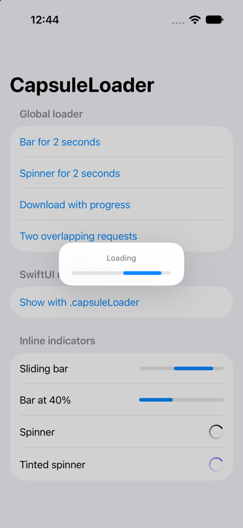
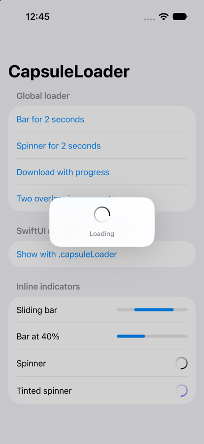
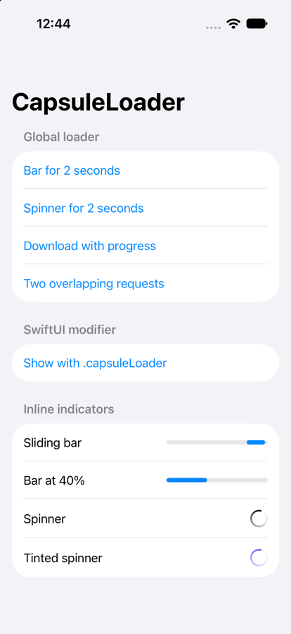

# CapsuleLoader

[](https://github.com/r-kumar-21/CapsuleLoader/actions/workflows/ci.yml)
[](https://swift.org)
[](https://developer.apple.com/ios/)
[](https://swift.org/package-manager/)
[](LICENSE)

A small, macOS-inspired loader for iOS: the sliding capsule progress bar and the rotating activity ring, in a frosted panel.

Show it when an API call starts. Hide it when the call finishes.

<p align="center">
  
  &nbsp;
  
  &nbsp;
  
</p>

## Features

- One-line `show` / `hide`, or `run` that hides even when the call throws
- Overlapping requests are counted — the loader stays up until all finish
- Sliding (indeterminate) or determinate progress
- Full-screen, or scoped to a single view
- SwiftUI modifier and UIKit API
- Inline `CapsuleProgressBar` and `CapsuleSpinner` for your own layouts
- VoiceOver announcements, Dynamic Type, light and dark mode
- Swift 6 strict concurrency, zero dependencies, privacy manifest included

## Requirements

| CapsuleLoader | iOS  | Swift | Xcode |
| ------------- | ---- | ----- | ----- |
| 1.x           | 16+  | 6.0+  | 16+   |

## Installation

### Xcode

**File → Add Package Dependencies…**, paste the URL below, and choose **Up to Next Major Version** from `1.0.0`.

```
https://github.com/r-kumar-21/CapsuleLoader.git
```

### Package.swift

```swift
dependencies: [
    .package(url: "https://github.com/r-kumar-21/CapsuleLoader.git", from: "1.0.0")
],
targets: [
    .target(name: "YourApp", dependencies: ["CapsuleLoader"])
]
```

## Usage

### Show and hide

```swift
import CapsuleLoader

CapsuleLoader.show("Loading")
Task {
    defer { CapsuleLoader.hide() }
    posts = try await api.posts()
}
```

`run` does the show, the call, and the hide for you. The loader also hides if the call throws.

```swift
let posts = try await CapsuleLoader.run("Loading") {
    try await api.posts()
}
```

### Overlapping requests

Each `show` needs its own `hide`. If two API calls are in flight, the loader stays up until both have hidden.

```swift
CapsuleLoader.show()
CapsuleLoader.show()
CapsuleLoader.hide() // still visible
CapsuleLoader.hide() // now hidden
```

`CapsuleLoader.hideAll()` clears it immediately.

### Progress

The default style is the capsule bar, sliding until you know a fraction:

```swift
CapsuleLoader.show("Downloading", style: .bar)
CapsuleLoader.setProgress(0.35)
CapsuleLoader.setProgress(1)
CapsuleLoader.hide()
```

`CapsuleLoader.setProgress(nil)` goes back to the sliding animation.

### Spinner

```swift
CapsuleLoader.show("Fetching posts", style: .spinner)
```

### One screen only

```swift
CapsuleLoader.show("Loading", in: view)
```

Touches outside that view still work. `CapsuleLoader.hide()` removes it.

### Dim and color

```swift
CapsuleLoader.configure(.init(dimsBackground: false, blocksInteraction: true))
CapsuleLoader.setIndicatorColor(.systemIndigo)
```

### SwiftUI

```swift
struct FeedView: View {
    @State private var posts: [Post] = []
    @State private var isLoading = false

    var body: some View {
        List(posts) { post in
            Text(post.title)
        }
        .capsuleLoader(isPresented: isLoading, message: "Loading")
        .task { await load() }
        .refreshable { await load() }
    }

    private func load() async {
        isLoading = true
        defer { isLoading = false }
        posts = (try? await api.posts()) ?? posts
    }
}
```

`style: .spinner` switches the panel to the ring. `progress:` fills the bar when you have a fraction.

### Inline indicators

Use the indicators inside your own layout, without the full-screen panel.

```swift
// SwiftUI
CapsuleProgressBar()
CapsuleProgressBar(progress: 0.4)
CapsuleSpinner()

// UIKit
let bar = CapsuleProgressBarView()
let spinner = CapsuleSpinnerView()
```

## Example app

Open `Example/CapsuleLoaderExample.xcodeproj` and run it on a simulator to try every style.

## Contributing

Issues and pull requests are welcome. See [CONTRIBUTING.md](CONTRIBUTING.md).
To report a security issue, see [SECURITY.md](SECURITY.md).

## License

CapsuleLoader is available under the MIT license. See [LICENSE](LICENSE).
